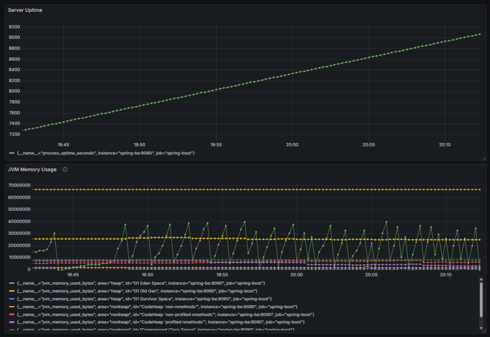

# 🦀 RUST_ST
우테코 프리코스 파이널_러스트 맛보기🤤

## 🎯 왜 Rust인가?


처음에는 평소에 궁금했던 Ruby로 시도하려고 했습니다.

하지만 실제로 하루 동안 해보니 Python을 이미 아는 입장에서 Ruby는 너무 익숙했고, **진짜 도전**이 되지 못할 것 같았습니다.

제가 알고 있는 기존의 언어들과 완전히 다른 패러다임을 가진 언어에 도전해야만 했습니다.

Rust가 쉽지 않다는 건 이미 알고 있었지만, 우테코에서 말하는 🔥진짜 도전🔥을 해보고 싶었습니다.

그래서 쉽지 않은 길이고, 어쩌면 완성 가능성조차 불확실한 걸 알면서도 선택한 것이 **Rust**입니다.

----

## 🎯 최종 결과물: Rudis

이 리포지토리의 핵심 프로젝트는 **Redis 클론인 Rudis**입니다.
Rust의 소유권, 비동기 프로그래밍, 시스템 프로그래밍을 통합적으로
경험할 수 있는 실제 작동하는 MemoryDB 애플리케이션입니다.

[📌 자세한 정보 → rudis/README.md](https://github.com/sunJ0120/Rudis/blob/main/rudis/README.md)

## 📅 프로젝트 진행 타임라인

| 날짜                      | 학습 내용                                                  | 완료 |
|-------------------------|--------------------------------------------------------|------|
| 2025-11-07 ~ 2025-11-15 | Rust 공식문서로 기초 문법과 소유권 개념 공부                            | ✅ |
| 2025-11-15 ~ 2025-11-16 | Redis CLI 실습 및 Rudis 기본 기능 완성 & CLI 기반 local DB TEST 완료 | ✅ |
| 2025-11-16 ~ 2025-11-17 | 1차 MVP 완성 & TCP 기반 통신 구현을 위해 Tokio와 비동기 학습             | ✅ |
| 2025-11-22              | TCP 서버 구현 완료 & CLI를 서버 기반으로 변경해서 2차 MVP 완성             | ✅ |
| 2025-11-23              | 스프링 부트 서버 구성 & RESP 프로토콜 재정의하여 spring-data-redis와 연동 완료 | ✅ |
| 2025-11-24              | docker를 통한 컨테이너화 & ci 파이프라인 구축 완료 및 모니터링 검증 완료         | ✅ |

## 🎯 핵심 성과

- ✅ **Ownership & Borrowing** - Rust의 핵심 개념 이해
- ✅ **Tokio 비동기 프로그래밍** - 멀티클라이언트 TCP 서버 구현
- ✅ **RESP 프로토콜** - Redis 호환성 구현
- ✅ **Docker & CI** - 파이프라인 구축 완료
- ✅ **Prometheus & Grafana 모니터링** - 실시간 성능 추적 및 안정성 검증
- ✅ **25분 부하 테스트 검증** - 500+ 동시 요청 처리 중 메모리 누수 없음 확인



## ⚙️ 기술 스택


## 📁 프로젝트 구조
```
RUST_ST/
│
├── 🚀 rudis/                          # Redis 클론 메모리 DB (메인 프로젝트)
│   ├── src/
│   ├── Cargo.toml
│   ├── Dockerfile
│   └── README.md
│
├── 📚 rust_study/                     # Rust 기초 학습 기록
│   └── README.md                      # 학습 타임라인 & 진행 과정
│
├── 🔄 tokio_study/                    # Tokio 비동기 프로그래밍 학습
│   ├── src/
│   ├── Cargo.toml
│   └── README.md
│
├── ☕ be/                              # Spring Boot 성능 테스트 앱
│   ├── src/main/java/sunj/be/
│   ├── src/main/resources/
│   │   └── application.yml
│   ├── build.gradle
│   ├── Dockerfile
│   └── README.md
│
├── ⚙️ .github/workflows/              # CI/CD 파이프라인
│   ├── rudis-ci.yml                   # Rust 린트, 포맷, 테스트
│   ├── spring-boot-ci.yml             # Java 빌드, 테스트
│   ├── integration-test.yml           # 통합 테스트 (Docker Compose)
│   └── docker-build.yml               # Docker 이미지 빌드
│
├── 🐳 docker-compose.yml              # 전체 스택 (Rudis + Spring + Prometheus + Grafana)
├── 🔥 prometheus.yml                  # prometheus 설정
├── 📄 README.md                       # (현재 파일)
└── .gitignore
```

## 📚 각 단계별 상세 내용

[📌 rust_study : 러스트 기본 문법 공부집](https://github.com/sunJ0120/Rudis/blob/main/rust_study/README.md)

[📌 tokio_study : Tokio 기본 문법 공부집](https://github.com/sunJ0120/Rudis/blob/main/tokio_study/README.md)

[📌 Rudis : 나만의 아주 작은 Redis](https://github.com/sunJ0120/Rudis/blob/main/rudis/README.md)

[📌 spring_be 서버 : Rudis 테스트 api](https://github.com/sunJ0120/Rudis/blob/main/be/README.md)

> 각각의 리드미에 들어가면 각 폴더에 대한 설명과 공부 기록 문서가 존재합니다.

-----

## 📖 모든 학습 기록 모음집

[🦀 우테코 8기 도전기](https://hot-and-spicy0120.tistory.com/category/%EA%B0%9C%EC%9D%B8%20%EB%82%99%EC%84%9C%EC%9E%A5/%EC%9A%B0%ED%85%8C%EC%BD%94%208%EA%B8%B0%20%EB%8F%84%EC%A0%84%EA%B8%B0)

> 해당 카테고리의 모든 글을 참고해주세요!!
